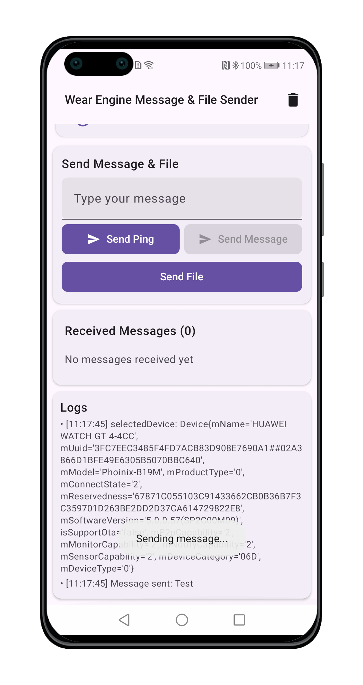
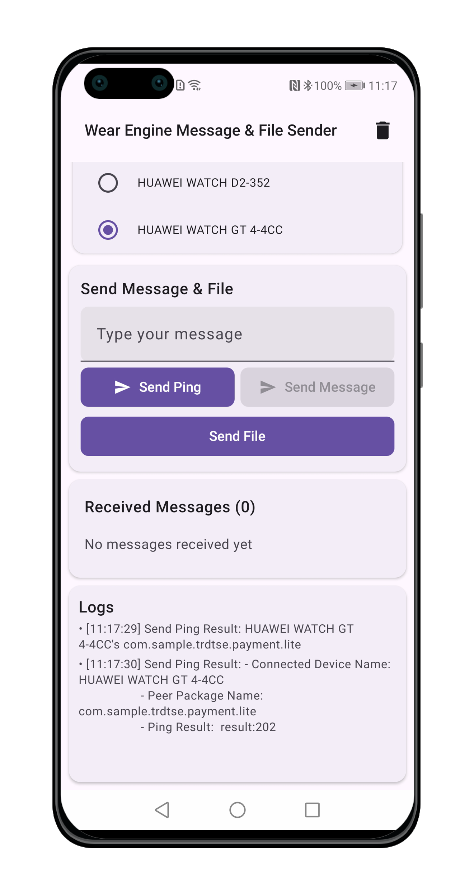
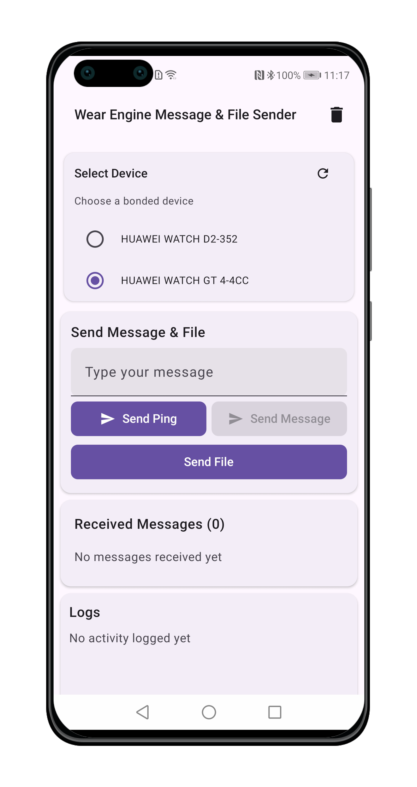

> **Note:** To access all shared projects, get information about environment setup, and view other guides, please visit [Explore-In-HMOS-Wearable Index](https://github.com/Explore-In-HMOS-Wearable/hmos-index).

# [Mobile to Watch] WearEngine Message & File Send/Receiver

Android P2P Communication Demo using Huawei Wear Engine SDK
Secure peer-to-peer communication between Android devices and Huawei wearables. 
Demonstrates message transmission, file transfer, and device management using Wear Engine SDK.

# Preview

|  |  |  |  |
|-----------------------------------------|-----------------------------------------|-----------------------------------------|-----------------------------------------|

# Use Cases
- Send secure messages between phone and watch
- Transfer files to wearable devices
- Verify if a package is installed on the target device using ping
- Automatic device discovery for paired wearables
- Permission management for wearable operations

# Technology
## Stack
- Languages: Kotlin
- Frameworks: Jetpack Compose, Wear Engine SDK, Huawei Wear Engine Services
- Tools: Android Studio,Gradle, Huawei AppGallery Connect

## Required Permissions and Configs

```android.permission.READ_EXTERNAL_STORAGE```
```com.huawei.wearengine.permission.DEVICE_MANAGER```

**P2P Communication Setup:**
- ```p2pClient.setPeerPkgName("")``` // Set peer package name
// Set peer fingerprint (For Smart Next Watch(like watch5) use appID, for [lite(like gt/fit/d/ultimate series)/smart wearable(watch4/3)](https://developer.huawei.com/consumer/en/doc/connectivity-guides/signature-0000001053969657))
- ```p2pClient.setPeerFingerPrint("")``` Set peer fingerprint

Documentation Link:
- [Applying for the Wear Engine Service](https://developer.huawei.com/consumer/en/doc/connectivity-Guides/applying-wearengine-0000001050777982)
- [Wear Engine SDK](https://developer.huawei.com/consumer/en/doc/connectivity-Guides/integrating-phone-sdk-0000001051137958)
- [Version Change History](https://developer.huawei.com/consumer/en/doc/connectivity-Guides/version-change-history-0000001086350238)
- [Android Phone App Development](https://developer.huawei.com/consumer/en/doc/connectivity-guides/phone-dev-0000001086797354)

## Key Components
P2pManager
- Handles message sending/receiving using Wear Engine P2P client
- Manages peer package fingerprint verification
- Implements ping functionality for connection testing
- Registers message receivers for bidirectional communication
- The file is saved in ```/data/data/{your app package}/files/WearEngine```.

DeviceManager
- Discovers and lists bonded Huawei wearable devices
- Retrieves device information (name, capabilities, connection status)
- Manages device selection for communication

AuthManager
- Handles `DEVICE_MANAGER` permission requests
- Validates required permissions for wearable access
- Provides permission status callbacks


# Directory Structure
```
├───java
│   └───com
│       └───hmosdemos
│           └───wearable
│               └───wearengineandroidwatchfilemessagesender
│                   │   MainActivity.kt
│                   │
│                   ├───data
│                   │   └───models
│                   │           DeviceState.kt
│                   │           FileState.kt
│                   │           MessageState.kt
│                   │
│                   ├───domain
│                   │   └───models
│                   │           UiState.kt
│                   │
│                   ├───managers
│                   │       AuthManager.kt
│                   │       DeviceManager.kt
│                   │       P2pManager.kt
│                   │
│                   ├───ui
│                   │   │   WearEngineApp.kt
│                   │   │
│                   │   ├───screens
│                   │   │   │   MessageFileSendScreen.kt
│                   │   │   │
│                   │   │   └───components
│                   │   │           LogCard.kt
│                   │   │           ReceiveMessageCard.kt
│                   │   │           SelectDeviceCard.kt
│                   │   │           SendFileCard.kt
│                   │   │           SendMessageCard.kt
│                   │   │
│                   │   └───theme
│                   │           Color.kt
│                   │           Theme.kt
│                   │           Type.kt
│                   │
│                   └───viewmodels
│                           MainViewModel.kt
│                           MainViewModelFactory.kt
```
# Constraints and Restrictions

## Supported Devices
- Android Phones
- HMS/GMS Huawei Phones

## Requirements
- [Applying for the Wear Engine Service](https://developer.huawei.com/consumer/en/doc/connectivity-Guides/applying-wearengine-0000001050777982)
- Huawei Health App need to be installed on Phone
- [Wear Engine SDK](https://developer.huawei.com/consumer/en/doc/connectivity-Guides/integrating-phone-sdk-0000001051137958)
- Paired Huawei wearable
- Device Manager permissions
- Configured peer fingerprints (lite wearable or smart wearable)

# LICENSE
[Mobile to Watch] WearEngine Message & File Send/Receiver is distributed under the terms of the MIT License.
See the [license](/LICENSE) for more information.